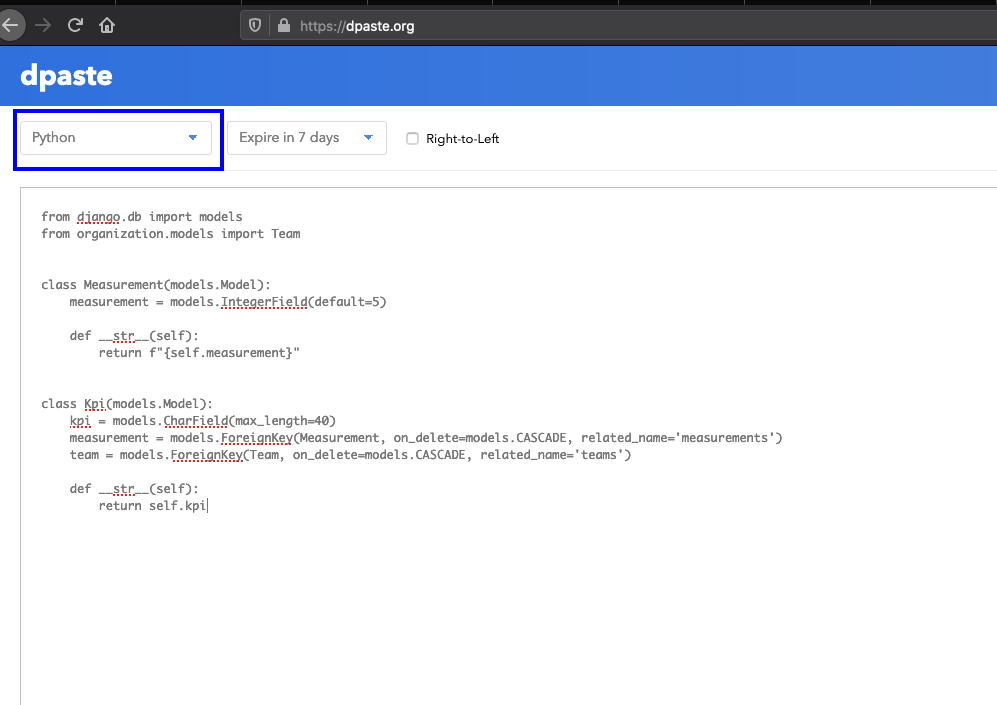

## How to Use a Code Share/Pastebin

### All respected coding forums expect the OP to provide formatted code. This concept is particularly important in Python because in Python indentation == code.

It is simple, you just go to https://www.ppaste.org, https://dpaste.org, https://gist.github.com/ or pick your favorite. 

    1. Ensure Python is selected for correct syntax highlighting (adjust for html as required)  
    
    2. Copy and paste your code into the space provided  
    
    3. Hit the Paste Snippet button.
    <h1 align="center"></h1>    
    
    4. Copy the URL generated, and share the URL in your post or comment  
    
